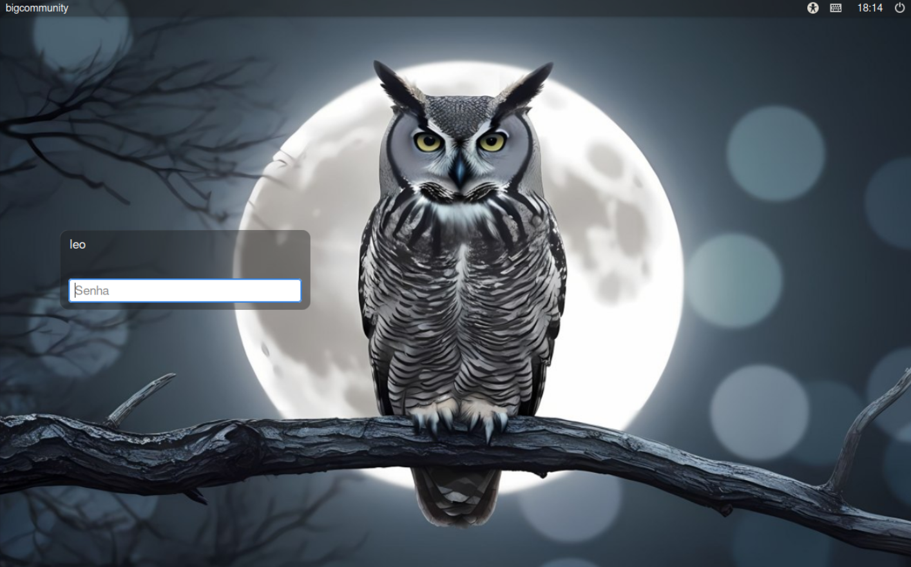

# comm-openbox

# comm-openbox

**comm-openbox** is a **CommunityBig** metapackage that provides a fully configured and ready-to-use **Openbox** environment.

**Openbox** is a highly configurable, ultra-lightweight window manager — not a full desktop environment — built for speed and simplicity. It's especially well-suited for older or low-spec computers, as it consumes very few system resources while remaining fast, flexible, and visually elegant when properly themed.

This package is ideal for users who want a smooth, responsive, and visually appealing desktop experience without compromising performance — particularly on modest hardware.

> 🎨 This project was **inspired by the excellent work of [Archcraft](https://github.com/archcraft-os/archcraft-openbox)**, adapted and enhanced for the CommunityBig/Manjaro ecosystem.


---

## 🖼️ Screenshots

Here’s a preview of what the `comm-openbox` environment looks like in action:




## 🖥️ What’s Included?

The `comm-openbox` package installs and configures:

- **Openbox** with full configurations (`rc.xml`, icon-based menus with custom keybindings).
- **Rofi** with transparency, integrated themes, and modern style.
- **Picom** as a lightweight compositor with transparency support.
- **Nitrogen** for wallpaper management.
- **Alacritty** and **Kitty** as modern, fast terminal emulators.
- **LightDM** as a simple login display manager.
- **Plank** as a minimal and elegant dock.
- **Oh My Posh** for a beautiful and informative terminal prompt.
- **Obmenu-generator**, **Pipemenus**, and **Menulib** for dynamic and contextual menus.
- **GTK themes and icons** for a cohesive visual experience.
- Helpful scripts, environment variable settings, and shell adjustments.

---

## 📁 Directory Structure

| Path                        | Description                                       |
|----------------------------|----------------------------------------------------|
| `alacritty/`, `kitty/`     | Terminal configurations                           |
| `autostart`                | Openbox startup commands                          |
| `bashrc/`, `.bashrc.pacnew`| Shell tweaks and customizations                   |
| `gtk-3.0/`, `gtk-4.0/`     | GTK themes and appearance                         |
| `icons/`, `.icons/`        | Icon sets                                         |
| `lightdm/`                 | Login manager settings                            |
| `menu-*.xml`               | Openbox menu layouts                              |
| `menulib/`                 | Menu helper library                               |
| `networkmanager-dmenu/`    | Simple dmenu-based network interface              |
| `nitrogen/`                | Wallpaper configuration                           |
| `obmenu-generator/`        | Automatic menu generation                         |
| `ohmyposh/`                | Stylish terminal prompt                           |
| `picom/`                   | Compositor configuration                          |
| `pipemenus/`               | Contextual and dynamic menus                      |
| `plank/`                   | Dock configuration                                |
| `rc.xml`                   | Main Openbox configuration                        |
| `scripts/`                 | Utility and automation scripts                    |
| `themes/`                  | Desktop visual themes                             |
| `xfce4/`                   | Additional XFCE components used by the system     |
| `environment`              | Global environment variables                      |

---

## 🚀 How to Use

After installing the `comm-openbox` metapackage, restart your session and select **Openbox** from the login screen.

You’ll get:

- Icon-based menus with categorized shortcuts.
- Transparent, modern, and clean interface.
- A responsive and low-resource desktop environment.

---

## 📦 Installation

If you're using **BigCommunity** or **Manjaro** with the CommunityBig repositories:

```bash
sudo pacman -S comm-openbox
